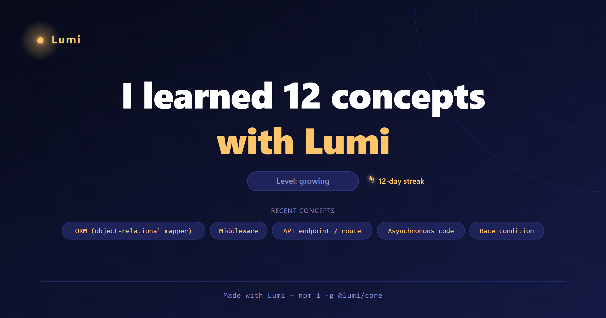
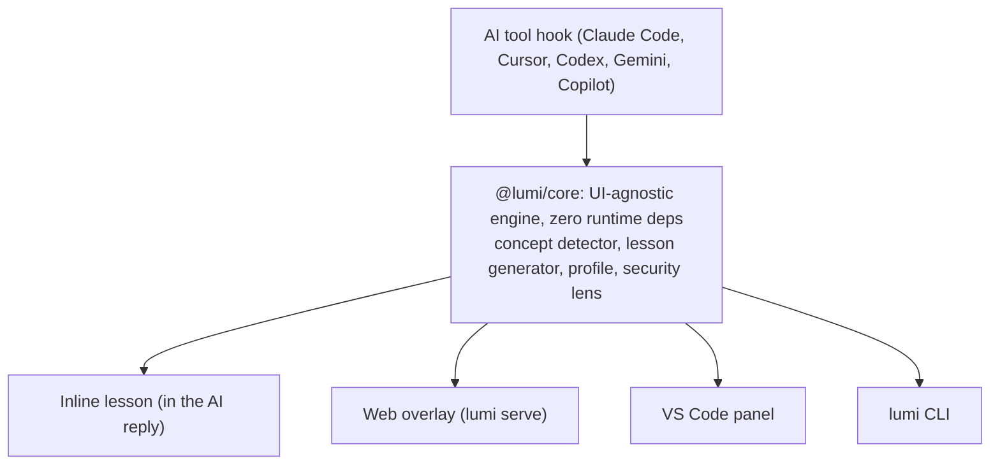

# Lumi — your AI coding mini-teacher

[](https://github.com/stefanbogdanmda/lumi/actions/workflows/ci.yml)
[](LICENSE)


**Build with AI, and actually understand what you shipped.** Lumi is a friendly mini-teacher
that rides *inside* the AI coding tool you already use. The moment the AI does something
technical, Lumi teaches you the concept behind it in plain English — then **remembers** it
across tools, **reviews** it so it sticks, and **flags when the AI does something risky**.

Built for **non-technical builders** — founders, career-switchers, bootcamp students, marketers
— who are tired of shipping code they can't read. You go from *"I built it and hope it's fine"*
to *"I understand what I built — and I know it's safe."*

Lumi runs on the AI tool's **own model** (your existing subscription) — **no separate login, no
API key, no extra cost** — with an offline fallback so it never hard-fails.

<p align="center">
  
  <br/>
  <em>Lumi turns what you learn into a shareable card — generated by <code>lumi card</code>.</em>
</p>

---

## Why Lumi is different

Other tools either **write code for you** or **explain a snippet when you ask**. Lumi is the only
one that does all of this, unprompted, on *your real work*:

- **Teaches** the concept behind what the AI just did — the first time it appears, once.
- **Remembers** what you've learned **across every tool** you use (the part incumbents
  structurally can't copy — their memory stays locked in their own product).
- **Keeps you safe** — a built-in security lens flags risky patterns (leaked keys, secrets in
  the frontend, missing access control) and `lumi audit` grades AI output **A–F** with fixes.
  This is the wedge: the documented "vibe-coding disasters" all trace back to non-technical
  builders shipping code they couldn't check. Lumi turns each risk into a lesson you keep.

---

## What Lumi does

### Learn — a lesson the moment a concept appears
- Watches both what the AI **says** and what it **does** (commands run, files written).
- Detects new concepts from a **136-concept dictionary** (including a deep security category),
  with anchored matching so ordinary English doesn't trigger false lessons.
- Writes a short, jargon-free, analogy-led lesson that **adapts to your level**
  (beginner → growing → confident). Teaches **at most 2 concepts per turn** so you're never flooded.
- Every lesson links to an honest **"learn more"** source so you can go deeper.
- Want to learn without waiting? **`lumi learn`** teaches the next concept on your path on
  demand, and **`lumi explain`** answers a specific term (typo-tolerant, with "did you mean").

### Remember — so it actually sticks
- **Teach-once + cross-tool memory:** learn `environment variable` in Cursor, and Lumi won't
  re-teach it in Claude Code. Your record lives locally under `~/.lumi`.
- A growing **personal glossary** of everything you've learned, in plain English.
- **Spaced-repetition review** brings concepts back before you forget them, with
  **guess-before-reveal active recall** in the overlay so each review is a real memory event.
  From the terminal, `lumi review --got "<term>"` (or `--forgot`) records how recall went so
  the schedule actually advances.

### Stay safe — the security lens
- `lumi check` runs a security lens over AI output and flags risky patterns in plain English
  ("why this is risky / how to fix").
- `lumi audit` produces an **A–F safety report** with the top fixes to make first.

### Keep going — habits, structure, and proof
- **Learning paths** (`lumi path`) — ordered skill ladders over the concepts you meet, with progress.
- **"What to build next"** coach (`lumi next`) and a **prompt polisher** (`lumi prompt`).
- **Daily goal, streaks, streak freeze, and badges** to build the habit.
- **Un-stuck coach** (`lumi unstuck`) spots an AI fix-loop and coaches a way forward.
- **Shareable progress card** (`lumi card`), **weekly digest** (`lumi digest`), and a milestone
  **certificate** (`lumi certificate`, at 10+ concepts).

---

## Where Lumi shows up (the surfaces)

One shared lesson feed keeps every surface in sync:

- **Inline** — a "🪄 Lumi — quick lesson" appended right inside the AI's reply. Works in the
  terminal, on desktop, and on the **mobile app** via the Claude Code plugin.
- **Web overlay** (`lumi serve`) — a tool-agnostic browser window you pin on top of your work,
  with tabs for **Lessons · Glossary · Review · Explain · Coach · Prompt · Paste · Paths · Digest**.
- **VS Code side-panel** — lesson cards with **"Makes sense ✅ / Still fuzzy 🤔"** buttons, plus
  Glossary, Review, and Explain.
- **CLI** — the full `lumi` command set (below).

---

## Which AI tools it works with

Lumi's brain is tool-agnostic. It connects to your tool's "after the AI responds" hook:

| Tool | Status |
|---|---|
| **Claude Code** | Live-tested (terminal, desktop, mobile) |
| **Codex, Cursor, Gemini CLI, Copilot, OpenCode** | Adapter hooks shipped; verified offline, live-verify on a real machine |
| **Any tool** (incl. browser builders like Lovable, Bolt, v0, Replit) | **Paste mode** — paste what the AI did, get lessons |

See [`adapters/README.md`](adapters/README.md) for per-tool hook setup and exactly what's been
verified live vs. offline.

---

## Quick start

**1. Inline (recommended — works on mobile).** In Claude Code, type:

```
/plugin marketplace add stefanbogdanmda/lumi
/plugin install lumi@lumi
```

Then use Claude Code normally — when a new concept appears you'll see a **"🪄 Lumi — quick
lesson"** at the end of the reply.

**2. Connect your other AI tools.** First install the `lumi` command, then wire it into Codex, Cursor, and the rest:

```
npm install -g @lumi/core   # installs the `lumi` CLI
lumi setup --all            # or: lumi setup cursor
lumi doctor                 # check everything is connected
```

**3. Open the web overlay** (any tool, any time):

```
lumi serve           # then open http://localhost:4321
```

Full install + troubleshooting: **[`docs/INSTALL.md`](docs/INSTALL.md)**.
For exactly how it works under the hood: **[`docs/WHAT-LUMI-DOES.md`](docs/WHAT-LUMI-DOES.md)**.

---

## Command reference

| Command | What it does |
|---|---|
| `lumi progress` | How many concepts you've learned, and your level |
| `lumi stats` | Streak, topics, recent concepts, badges |
| `lumi glossary [--out <file>]` | Print your personal glossary, or save it to a Markdown file |
| `lumi topics [<category>]` | Browse every concept Lumi can teach, by category |
| `lumi explain "<term>"` | Explain a specific concept now (typo-tolerant, suggests close matches) |
| `lumi learn` | Teach me the next concept on my path — proactive, guided learning |
| `lumi next` | Suggest what to build next — and why — for where you're at |
| `lumi prompt "<idea>"` | Turn a rough idea into a clear, ready-to-paste prompt |
| `lumi review [--got\|--forgot "<term>"]` | Refresh due concepts; record how recall went |
| `lumi feed [--source S]` | Detect concepts from captured tool output and write lesson events |
| `lumi path` | Learning-path progress and your next recommended concept |
| `lumi card [--out <file>]` | Generate a shareable SVG progress card |
| `lumi check` | Run a security lens over piped input and flag risky patterns |
| `lumi audit` | Grade piped AI output for safety (A–F report with fixes) |
| `lumi goal [<n>]` | View or set your daily learning goal |
| `lumi digest` | Print your weekly learning recap |
| `lumi certificate [--out]` | Generate a "Lumi Verified" certificate (at 10+ concepts) |
| `lumi unstuck` | Spot an AI fix-loop in piped output and coach a way forward |
| `lumi freeze [--add]` | View or bank streak-freeze tokens (Pro) |
| `lumi serve [--port N]` | Start the web overlay server (default port 4321) |
| `lumi setup [tool\|--all]` | Connect Lumi to your AI tool(s) automatically |
| `lumi export` / `lumi import <file>` | Move your learning between machines |
| `lumi welcome` | Show the getting-started guide |
| `lumi upgrade` / `lumi license [<key>]` | See Lumi Pro / activate a license key |
| `lumi doctor` | Check that Lumi is set up correctly |

(Run `lumi help` for the live list.)

---

## How lessons are generated — no API key, no extra cost

Lumi writes lessons using the **AI tool you already pay for**. The inline plugin uses Claude Code
directly; for other tools, Lumi's feed uses *that tool's own model* (`--source codex` uses Codex,
`--source gemini` uses Gemini, others default to Claude). There's **no separate login, no API key,
and no extra usage cost**. If the tool's model isn't reachable, Lumi falls back to a basic
built-in lesson so it **never hard-fails**.

Your progress is stored locally under `LUMI_HOME` (default `~/.lumi`) — `profile.json` plus a
human-readable glossary. Set `LUMI_HOME` to move it.

---

## What's new

See [`CHANGELOG.md`](CHANGELOG.md) for the full history. Recent additions include the **security
lens** (`check` / `audit` A–F report), **learning paths**, **habit mechanics** (daily goal,
streak freeze, badges), the **shareable progress card**, **weekly digest**, **certificates**, the
**un-stuck coach**, the tool-agnostic **web overlay** with active-recall review, **paste mode** for
browser builders, and **`lumi setup`** auto-installers for Codex, Cursor, Gemini, Copilot, and
OpenCode.

> Honest note on distribution: the inline Claude Code plugin and the CLI/overlay run today. The
> non-Claude adapters are verified offline (live-verify on a machine with that tool installed), and
> Marketplace/directory publishing is in progress — see the docs for the current state.

---

## Architecture

Lumi's core is a single UI-agnostic engine that every surface consumes through injected interfaces
(`LessonGenerator`, `LearningProfile`, `LessonCache`) — so the same logic powers the inline plugin,
the web overlay, the VS Code panel, and the CLI, and is fully testable offline.



## For developers

Lumi is a UI-agnostic **`@lumi/core`** package (TypeScript/Node) plus the surfaces that render its
lesson feed (inline plugin, web overlay, VS Code extension, CLI).

```bash
npm install
npm test --workspace core       # run the unit tests
npm run build --workspace core  # produce core/dist
```

---

## Docs

- **[`docs/WHAT-LUMI-DOES.md`](docs/WHAT-LUMI-DOES.md)** — exactly how Lumi works
- **[`docs/INSTALL.md`](docs/INSTALL.md)** — install & troubleshooting
- **[`adapters/README.md`](adapters/README.md)** — connect any AI tool

## License

[MIT](LICENSE).
